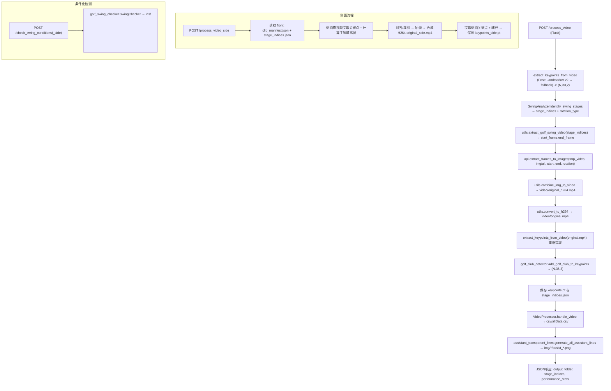

## AI Golf 挥杆视频分析系统

面向高尔夫挥杆视频的一体化分析系统：自动提取人体关键点、识别9大挥杆阶段、剪辑与H264重编码、检测球杆、导出CSV与可视化透明辅助线，并支持正/侧面条件化评测和报告生成。

### 功能综述
- 关键点提取：优先使用 MediaPipe Pose Landmarker v2（heavy），失败回退经典 Pose；输出 (N,33,2)
- 阶段识别：基于物理特征的 `0-8` 九阶段识别，并返回 `rotation_type`（none/clockwise/counterclockwise）
- 裁剪重编码：按阶段窗口抽帧，合成 H264 视频，方向统一
- 球杆检测：YOLO 检测握把/杆头两点，关键点增强为 (N,35,3)
- 数据产物：关键点、阶段索引、CSV/可视化、透明辅助线 PNG（站姿/骨架/鱼骨/K线/肩髋旋转）
- 条件化评测：正/侧面多项规则检测，生成 CSV/TXT 报告
- API 服务：Flask 提供端点，支持前后端对接

### 架构/流程图



### 目录结构（关键文件）
- `api.py`：Flask 入口，端到端视频处理/侧面对齐/评测 API
- `video_processor.py`：关键点提取（v2 优先、经典回退）、CSV 生成、阶段区间填充
- `swing_analyzer.py`：九阶段识别与旋转推断
- `golf_swing_checker.py`：正/侧面条件化检测与报告输出
- `assistant_transparent_lines.py`：透明辅助线 PNG 生成（站姿/骨架/鱼骨/K线/肩旋/髋旋）
- `golf_club_detector.py`：YOLO 球杆检测并增强关键点（新增 index 33/34）
- `config.py`：参数/阶段映射/检测规则与生效阶段配置
- `utils.py`：计时器、H264 转码、抽帧/合成、权限与图像I/O优化
- `keypoint_processor.py`：关键点预处理与区域掩码
- `keypoint_3d_processor.py`：2D→简化3D与动态特征（增强模型时使用）
- `frame_analysis.py`：单帧质量分析（人物大小/位置建议）
- `resultData/<session>/`：输出产物目录

### 安装与运行
1) 系统依赖
- Python 3.10+
- ffmpeg（PATH 可直接调用）
- 可选 GPU（PyTorch/YOLO 加速）

2) 安装依赖
```bash
cd AIGolf
python -m venv .venv && .\.venv\Scripts\activate   # Windows
pip install -r requirements.txt
pip install ultralytics==8.*  # YOLO 检测需要（requirements 未内置）
# 可选：下载 Pose Landmarker v2 heavy 模型到 model/pose_landmarker_heavy.task
```

3) 启动服务
```bash
python api.py  # 默认 http://0.0.0.0:5000
```

### API 使用
- 处理正面视频
```bash
curl -X POST "http://localhost:5000/process_video" \
  -F "video=@C:/path/to/video.mp4"
```

- 处理侧面视频并与正面会话对齐
```bash
curl -X POST "http://localhost:5000/process_video_side" \
  -F "video=@C:/path/to/side.mp4" \
  -F "video_name=test1"
```

- 生成正面/联合报告
```bash
curl -X POST "http://localhost:5000/check_swing_conditions" \
  -H "Content-Type: application/json" \
  -d "{\"video_name\":\"test1\",\"output_dir\":\"./AIGolf/resultData/test1\",\"csv_format\":true}"

curl -X POST "http://localhost:5000/check_swing_conditions_side" \
  -H "Content-Type: application/json" \
  -d "{\"video_name\":\"test1\",\"output_dir\":\"./AIGolf/resultData/test1\",\"csv_format\":true}"
```

- 强制将某会话视频转为 H264
```bash
curl -X POST "http://localhost:5000/convert_videos_to_h264" \
  -H "Content-Type: application/json" \
  -d "{\"session_id\":\"test1\",\"video_files\":[\"result.mp4\",\"original.mp4\"]}"
```

### 接口清单（详细说明 + 请求/响应示例）

- POST `/process_video`
  - 表单字段：`video`（必填，视频文件）
  - 主要流程：关键点提取 → 阶段识别 → 裁剪/抽帧/合成 → 关键点重提取 → 球杆增强 → CSV与辅助线
  - 响应示例：
  ```json
  {
    "msg": "视频处理与错误检测完成",
    "stage_indices": {"0":[12],"1":[30],"2":[45],"3":[60],"4":[82],"5":[95],"6":[110],"7":[132],"8":[150]},
    "output_folder": "./resultData/test1",
    "model_type": "basic",
    "performance_stats": {"total": {"count":1,"total":12.34,"mean":12.34}}
  }
  ```

- POST `/process_video_side`
  - 表单字段：`video`（必填，侧面视频文件）、`video_name`（必填，对齐的正面会话名）
  - 响应示例：
  ```json
  {
    "success": true,
    "message": "已生成 keypoints_side.pt",
    "keypoints_side": "./resultData/test1/keypoints_side.pt",
    "frames": 136,
    "fps": 30.0
  }
  ```

- POST `/check_swing_conditions`
  - JSON：`{"video_name":"test1","output_dir":"./AIGolf/resultData/test1","csv_format":true}`
  - 响应示例：
  ```json
  {"success": true, "message": "成功生成挥杆检查报告", "report_file": "./resultData/test1/vis/test1_report.csv"}
  ```

- POST `/check_swing_conditions_side`
  - JSON 同上（会读取同目录的 `keypoints_side.pt` 并合并入同一份报告）
  - 响应同上

- POST `/convert_videos_to_h264`
  - JSON：`{"session_id":"test1","video_files":["result.mp4","original.mp4"]}`
  - 响应示例：
  ```json
  {
    "status":"ok",
    "message":"视频转换处理完成",
    "results":{
      "result.mp4": {"status":"success","message":"视频已成功转换为H264编码"},
      "original.mp4": {"status":"success","message":"视频已成功转换为H264编码"}
    }
  }
  ```

### Python 调用示例

```python
import requests

# 处理正面视频
with open(r"C:\\path\\to\\video.mp4", "rb") as f:
    r = requests.post("http://localhost:5000/process_video", files={"video": f})
    print(r.json())

# 处理侧面视频并对齐
with open(r"C:\\path\\to\\side.mp4", "rb") as f:
    r = requests.post("http://localhost:5000/process_video_side", files={"video": f}, data={"video_name":"test1"})
    print(r.json())

# 生成联合报告（CSV）
r = requests.post("http://localhost:5000/check_swing_conditions_side",
                  json={"video_name":"test1","output_dir":"./AIGolf/resultData/test1","csv_format":True})
print(r.json())
```

### 函数速查（端点 → 内部调用映射）
- `/process_video`
  - 关键点：`video_processor.extract_keypoints_from_video`
  - 阶段/旋转：`swing_analyzer.SwingAnalyzer.identify_swing_stages`
  - 裁剪窗口：`utils.extract_golf_swing_video`
  - 抽帧与视频：`api.extract_frames_to_images` → `utils.combine_img_to_video` → `utils.convert_to_h264`
  - 球杆增强：`golf_club_detector.add_golf_club_to_keypoints`
  - CSV：`video_processor.VideoProcessor.handle_video`
  - 辅助线：`assistant_transparent_lines.generate_all_assistant_lines`

- `/process_video_side`
  - 读取 `clip_manifest.json` 与 `stage_indices.json`
  - 侧面顶点对齐：`api._compute_wrist_top_idx_from_keypoints`
  - 抽帧→合成→关键点→球杆：与正面流程等价

- `/check_swing_conditions(_side)`
  - 条件化检测：`golf_swing_checker.SwingChecker`（参数阈值见 `config.CHECK_PARAMS`，生效阶段见 `config.CONDITION_STAGE_RULES`）

---

## YOLO 球杆模型：标注与训练流程（yolo_dataset_full）

本项目内置完整的视频标注与自动训练流水线，用于产出 `golf_club_detector` 的 `best.pt` 权重。

### 1) 视频标注（生成 YOLO 标签）
- 启动脚本：`yolo_dataset_full/start_video_annotation.py`
- 标注系统：`video_annotation_system.VideoAnnotationSystem`（在同目录）
- 推荐参数：`mode='rotated_bbox'`，`frame_interval=10`，`max_frames_per_video=50`
- 交互操作：鼠标左键依次点击球杆两个端点（握把与杆头）；ESC 跳过帧
- 目录约定（Windows 默认）：
  - 输入视频：`C:\Users\Administrator\Desktop\AIGolf\videos`
  - 标注输出：`C:\Users\Administrator\Desktop\AIGolf\dataset`

输出结构示例：
```
dataset/
  images/            # 帧图
  annotations/       # YOLO 标签(.txt) 或中间格式(.json/.xml)
  processed_videos/  # 已处理记录
```

如需做格式转换/整理：
- 脚本：`yolo_dataset_full/convert_to_yolo.py`
- 示例：
```bash
python yolo_dataset_full/convert_to_yolo.py D:\raw_coco D:\yolo_out --input_format coco --validate
```

### 2) 自动训练
- 中枢脚本：`yolo_dataset_full/auto_training_system.py`（封装为 `AutoTrainingSystem`）
- 一键命令：
```bash
cd yolo_dataset_full
python train_yolo_auto.py
```
- 核心功能：
  - 自动检查 `dataset/` 新数据 → 转换为 YOLO → 去重 → 合并到 `processed/`
  - 重新划分 `processed/images|labels/{train,val}`
  - 生成 `configs/dataset.yaml`（YOLO 数据配置）
  - 智能选择训练参数（全新/增量）并调用 `ultralytics.YOLO(...).train()`
  - 输出 `models/latest/best.pt`，并将已训练数据归档到 `trained_data/`

训练使用的数据配置模板：`yolo_dataset_full/golf_club_detection_full.yaml`

### 3) 产出与集成
- 训练产物：`yolo_dataset_full/models/latest/best.pt`
- 推理集成点：`AIGolf/golf_club_detector.py` 中 `GolfClubDetector(model_path, confidence)` 与 `add_golf_club_to_keypoints(...)`
- 在 `/process_video` 与 `/process_video_side` 中，若权重可用，将把握把(33)/杆头(34)附加至关键点，形状从 (N,33,2|3) 扩展为 (N,35,3)


### 输出目录与文件说明（以 `resultData/<video_id>` 为例）
- `video/original.mp4`：方向统一的 H264 剪辑视频
- `img/all/frame*.jpg`：抽帧图像（方向与 `original.mp4` 一致）
- `img/<line_type>/assist_*.png`：透明辅助线（站姿/骨架/鱼骨/k/shoulder_rotation/hip_rotation）
- `csv/allData.csv`：每帧 33 点坐标与阶段标签
- `keypoints.pt`：关键点张量（增强后为 (N,35,3)）
- `keypoints_side.pt`：侧面关键点（可选）
- `stage_indices.json`：九阶段帧索引（键为字符串 "0".."8"）
- `clip_manifest.json`：fps、裁剪帧、need_rotate、rotation_type 等元信息
- `vis/<video_id>_report.(csv|txt)`：条件化评测报告

### 关键参数与可配置项
- `config.CHECK_PARAMS`：各检测项阈值（如髋部角度、躯干容差、轨迹范围等）
- `config.CONDITION_STAGE_RULES`：检测项生效阶段（支持 `pX`、`pX-pY`、逗号不连续）
- `config.MARGIN_CONFIG`：对关键阶段（如击球/顶点）边界扩展
- YOLO 权重路径：`yolo_dataset_full/runs/detect/golf_club_yolo/weights/best.pt`
- Pose v2 模型路径：`model/pose_landmarker_heavy.task` 或环境变量 `POSE_LANDMARKER_TASK`

### 阶段与旋转
- `swing_analyzer.identify_swing_stages(X)` → `stage_indices, rotation_type`
- 阶段键：`0=准备 1=引杆 2=起杆 3=上杆 4=顶点 5=下杆 6=击球 7=送杆 8=收杆`
- `rotation_type` 用于抽帧与辅助线方向统一

### 性能与日志
- 计时器：`utils.Timer`（开启于 `ENABLE_TIMING=True`），`/process_video` 响应附带 `performance_stats`
- 日志：`api.py` 将 stdout/stderr 重定向至 `AIGolf/logs/server_*.log`

### 常见问题（FAQ）
1. 未安装 ffmpeg → H264 转换失败/降级，安装后重试并确保在 PATH
2. 关键点提取为空 → 视频光照/遮挡/分辨率问题；建议提供 v2 heavy 模型，或更换视频
3. YOLO 权重缺失 → 安装 `ultralytics` 并放置权重，缺失时系统继续走 33 点流程
4. Windows 文件占用删除失败 → 系统已加入 `safe_delete_file` 重试/退出清理，避免外部占用

### 二次开发指引
- 新增检测项：在 `SwingChecker._register_check_functions()` 注册中文名→函数；在 `config.CONDITION_STAGE_RULES` 声明生效阶段；在 `config.CHECK_PARAMS` 配置阈值
- 调整阶段识别：修改 `swing_analyzer.identify_swing_stages()` 的候选评分/阈值或窗口
- 前端叠加：以同帧号将 `img/all/frame*.jpg` 与 `img/<line_type>/assist_*.png` 进行透明叠加

### 许可证
内部项目或按上游协议自定（如需对外发布请补充 License）。


